Computational Problem Set 1: Macro Data (Answers)
========================================================


Instructions: 
+ You must publish your homework on Rpubs.com before Thurdsay at 23:59 and upload a copy of your Rmd file to *your* GitHub repository. All your files must have your last name in the filename, e.g. `cps1_answer_mayer.*` .

+ Let me suggest to focus in your pure R script first, and then integrate text and code in your Rmd document.

+ There is a *starter* file in my repo. It's a good idea to get ahold of it by pull it to your local repo.

## Part I. A classic: Penn World Tables

+ Produce three plots (one per variable), showing in each plot, the corresponding time series for all your selected countries. 


```r
# Importar base de datos 1
db1 <- read.csv("pwt71_w_country_names.csv")
selectediso = c("GER", "CAN", "GRC")
gcgsel = subset(db1, isocode %in% selectediso)  #
gcgsel = droplevels(gcgsel)

# Pregunta 1 Gráficos Para GDP per capita (PPP) $ of 2005 make 'base'
# plot, will add features below
plot1 = qplot(year, rgdpch, data = gcgsel, geom = "path", colour = country)
plot2 = plot1 + geom_smooth(se = TRUE, linetype = 2)
plot3 = plot2 + labs(colour = "Countries", x = "Year", y = "GDP per capita (PPP), $ of 2005")
print(plot3)
```

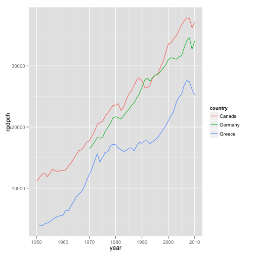 

```r

# Para Consumption Share of PPP Converted GDP(pc) at 2005 constant prices
# [rgdpl]
plot4 = qplot(year, kc, data = gcgsel, geom = "path", colour = country) + geom_smooth(se = TRUE, 
    linetype = 2) + labs(colour = "Countries", x = "Year", y = "Consumption Share of PPP Converted GDP(pc) 2005")
print(plot4)
```

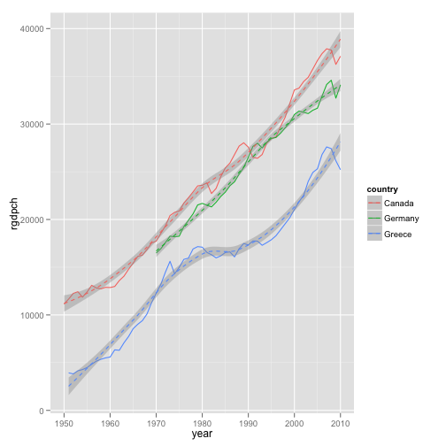 

```r

# Para Government Consumption Share of PPP Converted GDP(pc) at 2005
# constant prices [rgdpl]
plot5 = qplot(year, kg, data = gcgsel, geom = "path", colour = country) + geom_smooth(se = TRUE, 
    linetype = 2) + labs(colour = "Countries", x = "Year", y = "Government Consumption Share of PPP Converted GDP(pc) 2005")
print(plot5)
```

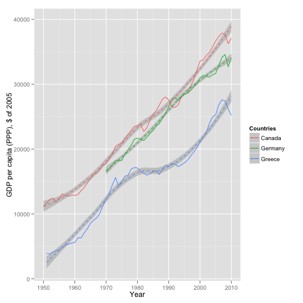 


+ Install and/or load the `tables` package. Produce a table similar to 
the first table presented in package's vignette. 


```r
# now a table na.omit is needed since otherwise mean and sd return NA
table1 = tabular((country + 1) ~ (n = 1) + Format(digits = 2) * (kc + ki + kg + 
    openk) * (mean + sd), data = na.omit(gcgsel))
table1
```

```
##                                                             
##              kc          ki          kg          openk      
##  country n   mean  sd    mean  sd    mean  sd    mean  sd   
##  Canada   60 70.05  2.93 19.90  2.44  7.16  0.56 46.65 16.03
##  Germany  40 68.92  1.45 22.73  1.92  7.03  1.22 47.89 19.88
##  Greece   59 70.05  6.53 25.94  6.79  9.46  1.10 30.91 16.83
##  All     159 69.77  4.43 22.86  5.19  7.98  1.49 41.12 18.96
```


## Part II. Cool new kid: Datamarket.com

+ Plot the data (in separate plots, if necessary). In fact, plot the data in three different ways. One, using `plot` with the option `plot.type="multiple`. Another one, also using `plot`, but with the option `plot.type="multiple`. A last one, using `ggplot2`'s commands. In the starter file, you may find examples for this.


```r
# Para Real Effective Exchange Rate. Sources: World Bank (citing: World
# Bank staff calculations based on Datastream and IMF International
# Finance Statistics data.)
erinfo = dminfo("http://data.is/OKBWv1")
erzoo = dmseries(erinfo)
erdf = dmlist(erinfo)

ersmalldf = dmlist(erinfo, Country = c("Australia", "Belize", "Uganda"))
ersmallzoo = dmseries(erinfo, Country = c("Australia", "Belize", "Uganda"))

plot1_er = qplot(Year, Value, data = ersmalldf, geom = "path", colour = Country)
print(plot1_er)
```

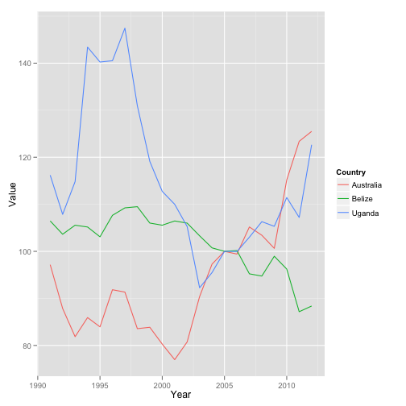 

```r

plot(ersmallzoo, plot.type = "single", lty = 1:3, col = 1:3)
legend(x = "bottomright", legend = colnames(ersmallzoo), lty = 1:3, col = 1:3)
```

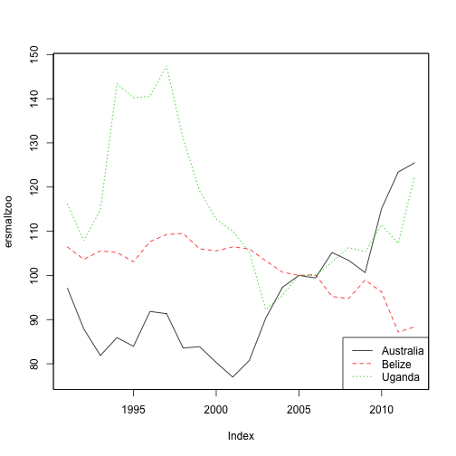 

```r

plot(ersmallzoo, plot.type = "multiple")
```

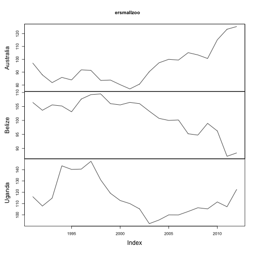 

```r

# Para Current Account Balance (% of GDP). Sources: World Bank (citing:
# International Monetary Fund, Balance of Payments Statistics Yearbook and
# data files, and World Bank and OECD GDP estimates.)
cainfo = dminfo("http://data.is/Q2PnYu")
cazoo = dmseries(cainfo)
cadf = dmlist(cainfo)

casmalldf = dmlist(cainfo, Country = c("Angola", "Estonia", "Fiji"))
casmallzoo = dmseries(cainfo, Country = c("Angola", "Estonia", "Fiji"))

plot1_ca = qplot(Year, Value, data = casmalldf, geom = "path", colour = Country)
print(plot1_ca)
```

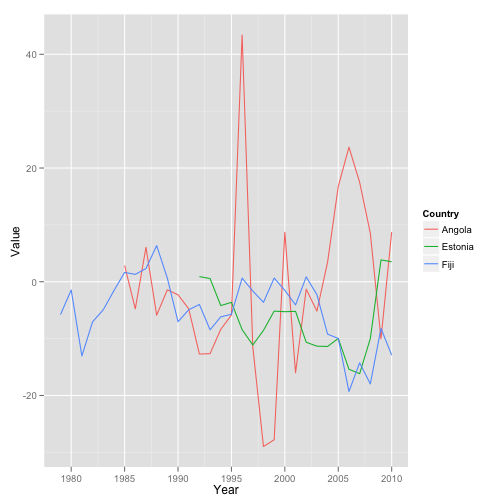 

```r

plot(casmallzoo, plot.type = "single", lty = 1:3, col = 1:3)
legend(x = "bottomright", legend = colnames(casmallzoo), lty = 1:3, col = 1:3)
```

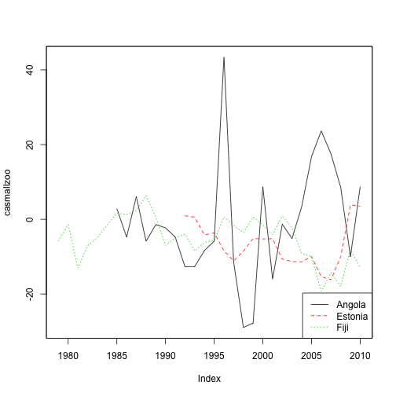 

```r

plot(casmallzoo, plot.type = "multiple")
```

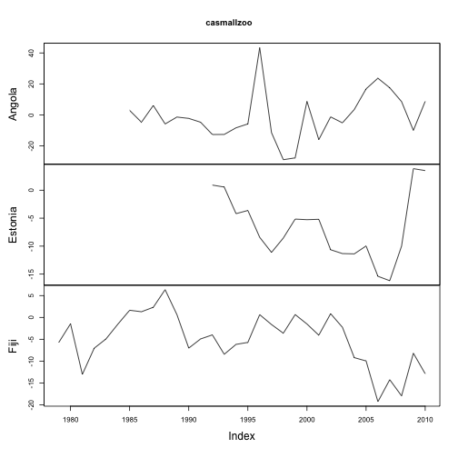 


## Part III. The local credit: Using BCCh' data.

+ Repeat something similar to what you did in Part I (i.e. plot and table), but using data taken from the web site of the Banco Central de Chile.


```r
# Importar base de datos 2
db2 <- read.csv("tcanual.csv")

# Pregunta 3 Gráficos Para Tipo de Cambio Nominal
plot6 = qplot(year, tcnom, data = db2, geom = "path") + geom_smooth(se = TRUE, 
    linetype = 2) + labs(x = "Año", y = "Tipo de Cambio Nominal (dólar observado $/USD)")
print(plot6)
```

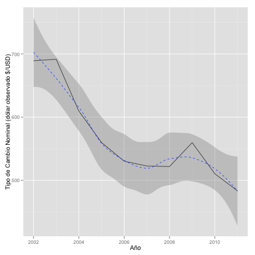 

```r

# Para Tipo de Cambio Real
plot7 = qplot(year, tcreal, data = db2, geom = "path") + geom_smooth(se = TRUE, 
    linetype = 2) + labs(x = "Year", y = "Tipo de Cambio Real (índice 1986=100)")
print(plot7)
```

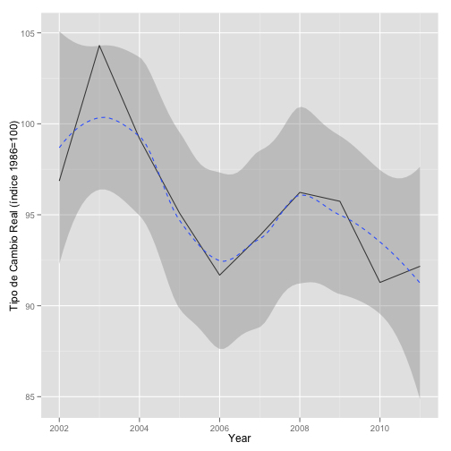 

```r

# Tablas
data2 <- matrix(c("TC_Nominal Promedio", "TC_Real Promedio", mean(db2$tcnom), 
    mean(db2$tcreal)), ncol = 2, byrow = TRUE)
table2 <- as.table(data2)
table2
```

```
##   A                   B               
## A TC_Nominal Promedio TC_Real Promedio
## B 567.834             95.639          
```


