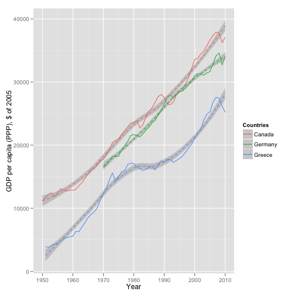

First computational Bayesian steps (Answers)
========================================================


Read the second chapter of Jim Albert's book (pages 19 to 35). While you are reading the book, or when you reading it again after a very quick first light-read, please copy, paste and execute every single line of code shown in the text. This will greatly help in you understanding of the material. Well, your task is simple: *create an R script with all the code you hace copied, pasted an executed while reading, BUT you must include also many comments (in spanish!) in your code, explaining what's going on*. After you hace your script, try to stitch it with knitr. Note: I'll ask you later to explain parts of your script to me, so you better understand it well!.


```r
# Página 21
p = seq(0.05, 0.95, by = 0.1)  #Genera una sucesión de valores de 0.05 a 0.95 con saltos de 0.1.
prior = c(1, 5.2, 8, 7.2, 4.6, 2.1, 0.7, 0.1, 0, 0)  #Genera un vector de pesos relativos para cada probabilidad.
prior = prior/sum(prior)  #Se obtiene la probabilidad a priori
plot(p, prior, type = "h", ylab = "Prior Probability")
```

 

```r

# Página 22
data = c(11, 16)  #Genera un vector son número de éxitos 11 y fracasos 16.
post = pdisc(p, prior, data)  #Computa la probabilidad a posteriori.
round(cbind(p, prior, post), 2)  #Combina los elementos de las columnas p, prior y post; redondea las probabilidades a dos decimales.
```

```
##          p prior post
##  [1,] 0.05  0.03 0.00
##  [2,] 0.15  0.18 0.00
##  [3,] 0.25  0.28 0.13
##  [4,] 0.35  0.25 0.48
##  [5,] 0.45  0.16 0.33
##  [6,] 0.55  0.07 0.06
##  [7,] 0.65  0.02 0.00
##  [8,] 0.75  0.00 0.00
##  [9,] 0.85  0.00 0.00
## [10,] 0.95  0.00 0.00
```

```r
library(lattice)
PRIOR = data.frame("prior", p, prior)  #Genera una tabla separando las probabilidades a priori.
POST = data.frame("posterior", p, post)  #Genera una tabla separando las probabilidades a posteriori.
names(PRIOR) = c("Type", "P", "Probability")  #Le asigna nombre a cada una de las columnas.
names(POST) = c("Type", "P", "Probability")
data = rbind(PRIOR, POST)  #Combina elementos de las filas a priori y a posteriori.
xyplot(Probability ~ P | Type, data = data, layout = c(1, 2), type = "h", lwd = 3, 
    col = "black")
```

 

```r

# Página 24
quantile2 = list(p = 0.9, x = 0.5)  #La persona considera que el percentil 90 se da en un 0.5.
quantile1 = list(p = 0.5, x = 0.3)  #La persona considera que el percentil mediano se da en un 0.3.
beta.select(quantile1, quantile2)  #Es una función que permite encontrar los parámetros de forma de la densidad de beta que conciden con el conocimiento previo. [a,b]
```

```
## [1] 3.26 7.19
```

```r

a = 3.26  #Parámetro encontrado según conocimiento de la persona.
b = 7.19
s = 11  # Número de éxitos
f = 16  # Número de fallos
curve(dbeta(x, a + s, b + f), from = 0, to = 1, xlab = "p", ylab = "Density", 
    lty = 1, lwd = 4)  #Probabilidad a posteriori.
curve(dbeta(x, s + 1, f + 1), add = TRUE, lty = 2, lwd = 4)  #Likelihood.
curve(dbeta(x, a, b), add = TRUE, lty = 3, lwd = 4)  # Probabilidad a priori.
legend(0.7, 4, c("Prior", "Likelihood", "Posterior"), lty = c(3, 2, 1), lwd = c(3, 
    3, 3))
```

 

```r

1 - pbeta(0.5, a + s, b + f)  #Probabilidad de que la proporción sea mayor o igual a 0.5 dada la información previa.
```

```
## [1] 0.06902
```

```r

# Página 25
qbeta(c(0.05, 0.95), a + s, b + f)  #Intervalo al 90% de confainaza para la proporción.
```

```
## [1] 0.2555 0.5134
```

```r

ps = rbeta(1000, a + s, b + f)  #Simula 1000 valores aleatorios para la proporción desde la función beta(a+s, b+f) posterior.
hist(ps, xlab = "p", main = "")
```

 

```r

# Página 26
sum(ps >= 0.5)/1000  #Calcula la probabilidad que la proporción sea mayor o igual a 0.5 (Porporción de valores simulados)
```

```
## [1] 0.075
```

```r
quantile(ps, c(0.05, 0.95))  #Intervalo al 90% de confianza, puede ser estimado por los quintiles 5th y 95th de la muestra.
```

```
##     5%    95% 
## 0.2579 0.5149 
```

```r

# Página 27
midpt = seq(0.05, 0.95, by = 0.1)  #Extrae el valor intermedio del intervalo.
prior = c(1, 5.2, 8, 7.2, 4.6, 2.1, 0.7, 0.1, 0, 0)  #Genera un vector de pesos relativos para cada probabilidad.
prior = prior/sum(prior)  #Se obtiene la probabilidad a priori
curve(histprior(x, midpt, prior), from = 0, to = 1, ylab = "Prior density", 
    ylim = c(0, 0.3))  #Refleja la opinión previa que posee el individuo sobre la proporción p.
```

 

```r

curve(histprior(x, midpt, prior) * dbeta(x, s + 1, f + 1), from = 0, to = 1, 
    ylab = "Posterior density")  #Une el histograma a priori con la función de verosimilitud, dando pie a la función de densidad a posteriori.
```

 

```r

# Página 28
p = seq(0, 1, length = 500)  #Genera un intervalo de 0 a 1 de 500 valores equivalentemente distribuidos.
post = histprior(p, midpt, prior) * dbeta(p, s + 1, f + 1)  # COmputa el prodcuto de la probabilidad a priori y la likelhood en el vector.
post = post/sum(post)

ps = sample(p, replace = TRUE, prob = post)  #Obtiene una muestra con reemplazo del vector.
hist(ps, xlab = "p", main = "")
```

 

```r

# Página 30
p = seq(0.05, 0.95, by = 0.1)  #Genera una sucesión de valores de 0.05 a 0.95 con saltos de 0.1. Vector de proporciones.
prior = c(1, 5.2, 8, 7.2, 4.6, 2.1, 0.7, 0.1, 0, 0)  #Genera un vector de pesos relativos para cada probabilidad. Vector de probabilidades actuales.
prior = prior/sum(prior)
m = 20
ys = 0:20  #Valor futuro de la muestra, y vector de número de sucesos éxitos de interes.
pred = pdiscp(p, prior, m, ys)  #Computa la distribución predecible de un número de sucesos exitosos de un experimento binominal futuro con una distribución discreta de proporción.
round(cbind(0:20, pred), 3)  #Combina los elementos de las columnas ys y predicción; redondea las probabilidades a tres decimales.
```

```
##           pred
##  [1,]  0 0.020
##  [2,]  1 0.044
##  [3,]  2 0.069
##  [4,]  3 0.092
##  [5,]  4 0.106
##  [6,]  5 0.112
##  [7,]  6 0.110
##  [8,]  7 0.102
##  [9,]  8 0.089
## [10,]  9 0.074
## [11,] 10 0.059
## [12,] 11 0.044
## [13,] 12 0.031
## [14,] 13 0.021
## [15,] 14 0.013
## [16,] 15 0.007
## [17,] 16 0.004
## [18,] 17 0.002
## [19,] 18 0.001
## [20,] 19 0.000
## [21,] 20 0.000
```

```r

# Página 31
ab = c(3.26, 7.19)  #Input de la función de densidad beta, parámetros a y b, respectivamente.
m = 20
ys = 0:20  #Valor futuro de la muestra, y vector de número de sucesos éxitos de interes.
pred = pbetap(ab, m, ys)  #Computa la distribución (beta) predecible de un número de sucesos exitosos de un experimento binominal futuro con una distribución discreta de proporción.

# Página 32
p = rbeta(1000, 3.26, 7.19)  #Simula 1000 valores aleatorios para la proporción desde la función beta(a, b) a priori.
y = rbinom(1000, 20, p)  #Simula los valores para el número de sucesos éxitosos a futuro.
table(y)  #Tabula los datos.
```

```
## y
##   0   1   2   3   4   5   6   7   8   9  10  11  12  13  14  15  16  17 
##  21  51  69 100 103 108 119 100  98  56  61  41  23  25  12   4   8   1 
```

```r

freq = table(y)  #Guarga las frecuencias en un vector.
ys = as.integer(names(freq))  #Le da nombre a la frecuencias (primera fila).
predprob = freq/sum(freq)  #Convierte las frecuencias en probabilidades al dividir cada una por la suma.
plot(ys, predprob, type = "h", xlab = "y", ylab = "Predictive Probability")  #Grafica la distribución de predicción.
```

 

```r

dist = cbind(ys, predprob)  #Combina las columnas ys y predprob.
dist
```

```
##    ys predprob
## 0   0    0.021
## 1   1    0.051
## 2   2    0.069
## 3   3    0.100
## 4   4    0.103
## 5   5    0.108
## 6   6    0.119
## 7   7    0.100
## 8   8    0.098
## 9   9    0.056
## 10 10    0.061
## 11 11    0.041
## 12 12    0.023
## 13 13    0.025
## 14 14    0.012
## 15 15    0.004
## 16 16    0.008
## 17 17    0.001
```

```r
covprob = 0.9  # 90% de probabilidad de cubrir el intervalo.
discint(dist, covprob)  #Computa el intervalo de probablidad superior para una distribución de probabilidad discreta. Otorga el conjunto creíble y la probabilidad de cobertura exacta.
```

```
## $prob
##    11 
## 0.906 
## 
## $set
##  1  2  3  4  5  6  7  8  9 10 11 
##  1  2  3  4  5  6  7  8  9 10 11 
## 
```

